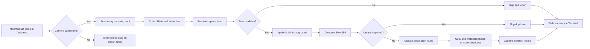

# material-organize

`material-organize` is the organizing/import side of the Material Manager product line. Its current shipped feature is the `material_importer` CLI for importing Sony camera RAW photos and videos into a material folder, grouped by trip day.

## Business Flow



## What It Does

- Scans all mounted SD cards under `/Volumes`.
- Treats any volume containing `DCIM` or `PRIVATE/M4ROOT` as a camera card.
- Supports dragging an import folder onto the launcher to import from that folder instead of scanning SD cards.
- Imports `.arw` and `.raw` photos only.
- Imports `.mp4`, `.mov`, and `.mxf` videos.
- Groups files by trip day, with anything before `04:00` assigned to the previous day.
- Copies files instead of moving them.
- Shows a `rich` progress bar and summary tables in Terminal.
- Skips duplicates using SHA-256 records stored in `/Users/lancer/materials/.material-import-manifest.jsonl`.

## Output Layout

- Photos: `/Users/lancer/materials/photos/YYYYMMDD`
- Videos: `/Users/lancer/materials/videos/YYYYMMDD`

Example filenames:

- `raw_20260411_091912_01.arw`
- `video_20260411_101858_01.mp4`

## Setup

Run this once from the repository root:

```bash
make setup
```

`make setup` will:

- install `python`, `poetry`, and `exiftool` through Homebrew
- install the Poetry environment
- copy the double-click launcher to `/Users/lancer/materials/Import Here.command`

## Commands

Run tests:

```bash
make test
```

Run a safe end-to-end smoke check into `/tmp`:

```bash
make smoke-test
```

`make smoke-test` runs the importer twice:

- first pass imports into `/tmp/material-organize-smoke`
- second pass confirms duplicate detection hits on the already imported files

Run the importer from the terminal:

```bash
make run
```

Run the importer manually through Poetry:

```bash
poetry run media-import
```

Run the importer against a specific source directory:

```bash
poetry run media-import --materials-root /Users/lancer/materials --source-root /Users/lancer/import
```

Read the AI workflow docs:

```bash
open .ai/README.md
```

## Verification Workflow

For code changes, use this order:

1. `make test`
2. `make smoke-test`
3. Only write into the real `/Users/lancer/materials` library when explicitly intended

## Double-Click Launcher

After `make setup`, double-click:

`/Users/lancer/materials/Import Here.command`

The launcher will:

- use the folder containing the launcher as the destination material root
- import from mounted SD cards when launched directly
- import from a dropped folder when you drag a folder onto the launcher
- look for the repository in `~/projects/material-organize`
- tell you to run `make setup` if Poetry or the virtualenv is missing

## Notes

- Videos use embedded metadata first.
- When video metadata is missing, Sony clip XML in `PRIVATE/M4ROOT/CLIP/*.XML` is used as a fallback.
- `videos/YYYYMMDD` is created only when at least one video is imported for that day.
- AI workflow docs live under `.ai/`.
